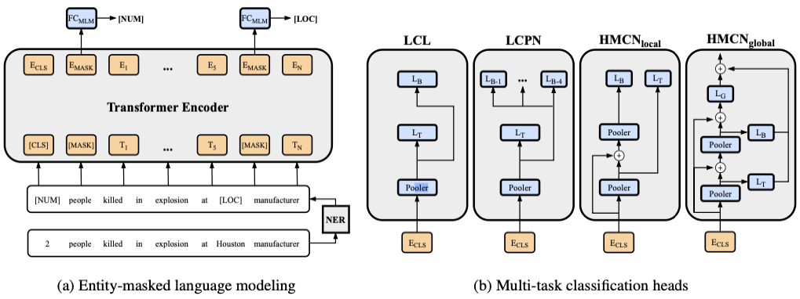

# Enhancing Crisis-Related Tweet Classification with Entity-Masked Language Modeling and Multi-Task Learning

- [Overview](#overview)
- [Requirements](#requirements)
- [Data](#data)
- [Quickstart](#quickstart)
- [Citation](#citation)

## Overview



## Requirements

You can install the necessary modules in your environment using `requirements.txt`.

```python
pip install -r requirements.txt
```

## Data

Due to the Twitter Developer Agreement and Policy we are not allowed to share the datasets in order to comply with the content redistribution.
The datasets and labels can be directly downloaded at [TREC Incident Streams](http://dcs.gla.ac.uk/~richardm/TREC_IS/2020/data.html).
The datasets are expected as json list in the following format:

```python
{
    "post_id": "...", 
    "text": "Nashville still cleaning up 2 months later after tornado https:...", 
    #"text": "[LOCATION] still cleaning up [NUMBER] months later after tornado [URL]", 
    "high_info_type": ["Other"], 
    "low_info_type": ["Irrelevant"], 
    "priority": "Low"
}
```

## Quickstart

### Task-Adaptive Pretraining

Pretrain the BERT model with Masked-Language Modeling:

```bash
# Masked-Language Modeling (MLM)
python3 -m src.pretrain \
--config configs/tapt/pretrain_mlm.yaml
```

```bash
# Proposed Entity-Masked-Language Modeling (E-MLM)
python3 -m src.pretrain \
--config configs/tapt/pretrain_emlm.yaml
```

### Finetuning

Finetune the classification model with the pretrained BERT model:

```bash
# Single-Task
python3 -m src.finetune_st \
--config configs/st/<configuration-file>
```

```bash
# Multi-Task / Hierarchical
python3 -m src.finetune_mt \
--config configs/mt/<configuration-file> \
--model <model-type>
```

The model type must match the classification-head used in the configuration:

- finetune_emlm_lcl.yaml: lcl
- finetune_emlm_lcpn.yaml: lcpn
- finetune_emlm_hmcn_local.yaml: hmcn_local
- finetune_emlm_hmcn_global.yaml: hmcn_global

### Evaluation

Print the scoring metrics to the console:

```bash
# Single-Task
python3 -m src.eval \
--experiment <experiment-dir> \
--with-low-labels
```

```bash
# Multi-Task / Hierarchical
python3 -m src.eval \
--experiment <experiment-dir> \
--with-low-labels \
--with-high-labels
```

## Citation

If you find our work helpful, please consider citing our official publication:

```bibtex
@inproceedings{seeberger2022enhancing,
    title={Enhancing Crisis-Related Tweet Classification with Entity-Masked Language Modeling and Multi-Task Learning},
    author={Philipp Seeberger and Korbinian Riedhammer},
    booktitle={Proceedings of the Second Workshop on NLP for Positive Impact (NLP4PI)},
    year={2022}
}
```